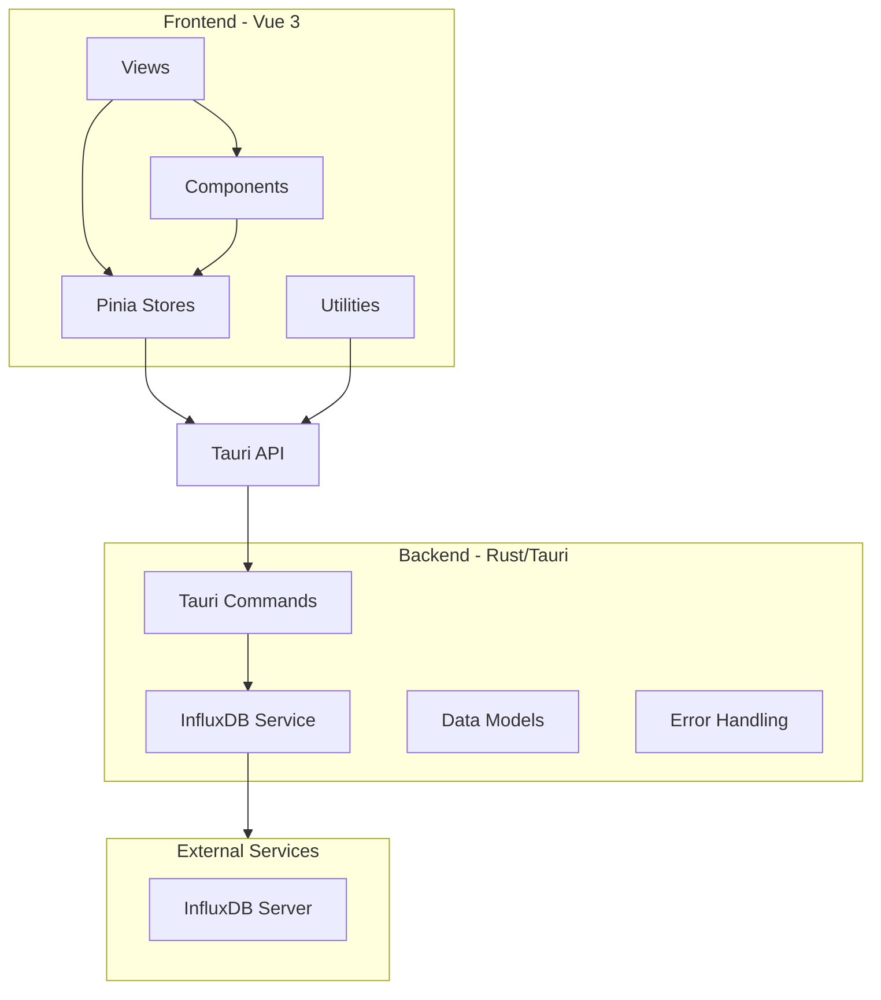
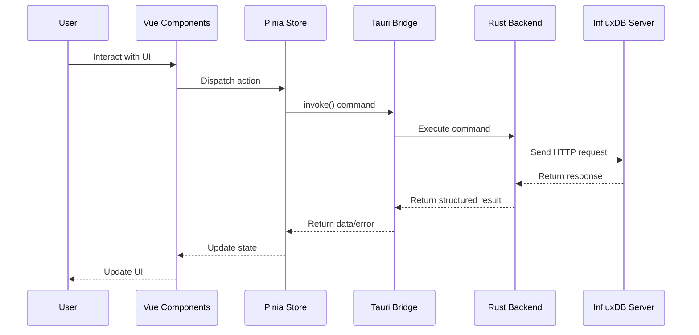
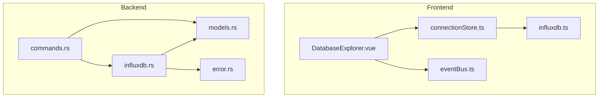

# Code Analysis Document

## Project Overview

InfluxDB Studio is a cross-platform desktop client for InfluxDB built with Tauri + Vue 3. The application provides a modern interface for connecting to and querying InfluxDB instances, with a focus on database management and visualization.

## Architecture Overview

The application follows a hybrid architecture with:

1. **Frontend**: Vue 3 + TypeScript + Element Plus
2. **Backend**: Rust with Tauri for native system integration
3. **Communication**: Tauri's invoke system for frontend-backend calls

### Key Components

## Data Flow Architecture

## Key Files and Dependencies

### Frontend

1. **Entry Point**
   - `src/main.ts`: Application initialization, plugin setup
   - `src/App.vue`: Root component

2. **Views**
   - `src/views/DatabaseExplorer.vue`: Main database exploration interface
   - `src/views/QueryEditor.vue`: SQL query editor and execution

3. **Stores**
   - `src/stores/connectionStore.ts`: Connection management and state
   - `src/stores/queryStore.ts`: Query history and execution state

4. **Components**
   - `src/components/Connection/ConnectionDialog.vue`: Connection configuration
   - `src/components/Query/OutputPanel.vue`: Query results display
   - `src/components/Common/MonacoEditor.vue`: Code editor integration

5. **Types**
   - `src/types/influxdb.ts`: TypeScript interfaces for InfluxDB entities

6. **Utilities**
   - `src/utils/eventBus.ts`: Event communication between components
   - `src/utils/debugHelper.ts`: Debugging utilities
   - `src/utils/queryValidator.ts`: SQL validation

### Backend

1. **Entry Point**
   - `src-tauri/src/main.rs`: Tauri application setup

2. **Core Modules**
   - `src-tauri/src/commands.rs`: Tauri command handlers
   - `src-tauri/src/influxdb.rs`: InfluxDB client implementation
   - `src-tauri/src/models.rs`: Data structures
   - `src-tauri/src/error.rs`: Error handling

## Module Dependencies

## Current Database Management Implementation

### Frontend

The current implementation in `DatabaseExplorer.vue` provides:

1. **Database Listing**: Fetches and displays databases from the connected InfluxDB instance
2. **Database Creation**: Basic dialog for creating new databases
3. **Database Deletion**: Confirmation dialog for deleting databases
4. **Measurement Listing**: Fetches and displays measurements within a selected database
5. **Measurement Deletion**: Uses SQL queries to delete measurements

Key limitations:
- Limited UI for database operations
- No dedicated measurement creation UI
- Basic styling without geek-style aesthetics
- No keyboard shortcuts
- Limited metadata display

### Backend

The backend implementation in `commands.rs` and `influxdb.rs` provides:

1. **Database Operations**:
   - `get_databases()`: Lists all databases
   - `create_database()`: Creates a new database
   - `drop_database()`: Deletes a database

2. **Measurement Operations**:
   - `get_measurements()`: Lists measurements in a database
   - Measurement deletion via SQL query execution

Key limitations:
- No dedicated measurement creation endpoint
- Limited metadata retrieval
- Basic error handling

## Integration Points for New Features

1. **Frontend Integration Points**:
   - Enhance `DatabaseExplorer.vue` with DataGrip-inspired UI
   - Add new components for database and measurement management
   - Create new Pinia stores for state management
   - Implement keyboard shortcuts and animations

2. **Backend Integration Points**:
   - Add dedicated measurement creation endpoint in `commands.rs`
   - Enhance metadata retrieval in `influxdb.rs`
   - Improve error handling and response formatting

## Technical Challenges

1. **InfluxDB Version Compatibility**:
   - Different APIs between InfluxDB v1.x, v2.x, and v3.x
   - Different query languages (InfluxQL vs Flux)

2. **UI Performance**:
   - Handling large database and measurement lists
   - Efficient rendering of tree views and data tables

3. **Error Handling**:
   - Consistent error handling across frontend and backend
   - User-friendly error messages

4. **Testing**:
   - Mocking InfluxDB responses for testing
   - Integration testing with real InfluxDB instances