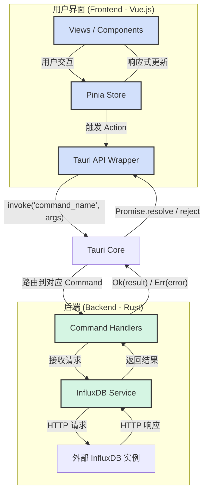
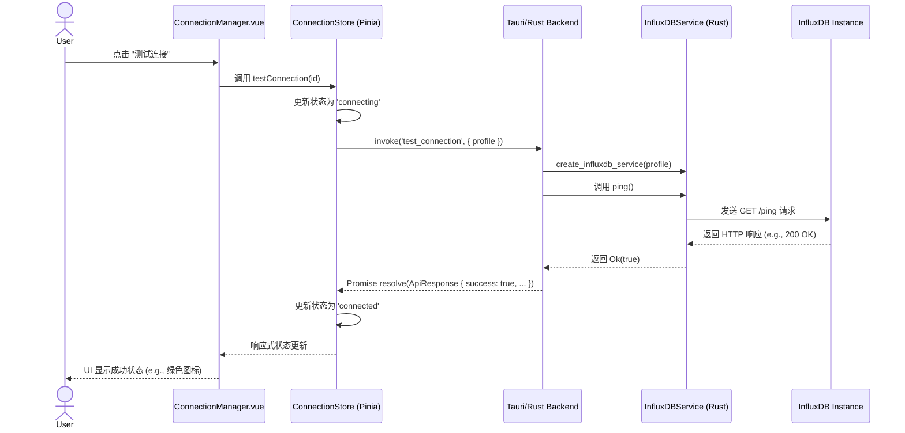

# InfluxDB UI 技术架构分析

本文档旨在深入分析 InfluxDB UI 项目的技术架构、代码结构和核心功能逻辑，为后续的开发和维护提供清晰的指引。

## 1. 项目整体架构概览

本项目采用 [Tauri](https://tauri.app/) 框架构建，是一个跨平台的桌面应用程序。其核心思想是将 Rust 作为后端，负责处理核心业务逻辑和系统交互，同时使用现代 Web 技术（Vue.js）构建用户界面。

-   **前端 (Frontend)**: 使用 **Vue 3** (Composition API) 和 **TypeScript** 构建，负责所有的用户界面和用户交互。
    -   **UI 框架**: **Element Plus** 用于构建美观且一致的 UI 组件。
    -   **状态管理**: **Pinia** 作为全局状态管理器，集中管理应用的连接配置、连接状态等核心数据。
    -   **构建工具**: **Vite** 提供了极速的开发服务器和高效的打包能力。
-   **后端 (Backend)**: 使用 **Rust** 编写，提供了高性能、高安全性的业务逻辑处理能力。
    -   **核心框架**: **Tauri** 负责创建窗口、管理 Webview，并提供了前端与后端之间的通信桥梁。
    -   **HTTP 客户端**: **Reqwest** 用于向 InfluxDB 实例发送 HTTP 请求。
    -   **序列化/反序列化**: **Serde** 用于在 Rust 结构体和 JSON (Tauri 通信) / API 响应之间进行转换。
    -   **日志**: **Tracing** 用于在后端记录日志，方便调试。
-   **通信 (Bridge)**: 前后端通过 Tauri 的 `invoke` 机制进行异步通信。前端可以调用在 Rust 后端注册的命令 (Commands)，并以 Promise 的形式接收返回结果。

### 整体架构图

## 2. 关键代码文件索引

| 文件路径                                       | 描述                                                                   |
| ---------------------------------------------- | ---------------------------------------------------------------------- |
| `package.json`                                 | 定义前端项目依赖、脚本和元数据。                                       |
| `vite.config.ts`                               | Vite 构建工具的配置文件。                                              |
| `src/main.ts`                                  | 前端入口文件，负责初始化 Vue 应用、Pinia 和路由。                      |
| `src/App.vue`                                  | Vue 应用的根组件。                                                     |
| `src/router/index.ts`                          | 定义前端页面的路由规则。                                               |
| `src/stores/connectionStore.ts`                | **核心状态管理**：存储所有连接配置、管理活动连接和连接状态，并封装了调用后端命令的逻辑。 |
| `src/components/Connection/ConnectionDialog.vue` | **核心 UI 组件**：用于创建和编辑连接配置的对话框。                     |
| `src/views/ConnectionManager.vue`              | **核心视图**：展示连接列表，并提供连接、测试、编辑和删除等操作的入口。 |
| `src-tauri/Cargo.toml`                         | 定义 Rust 后端项目的依赖 (crates) 和元数据。                           |
| `src-tauri/tauri.conf.json`                    | Tauri 应用的配置文件，包括窗口设置、允许的命令等。                     |
| `src-tauri/src/main.rs`                        | **后端入口文件**：负责构建和运行 Tauri 应用，并注册所有暴露给前端的命令。 |
| `src-tauri/src/models.rs`                      | **核心数据结构**：定义了 Rust 端所��的数据模型，如 `ConnectionProfile`。 |
| `src-tauri/src/commands.rs`                    | **前后端桥梁**：定义了所有可被前端 `invoke` 的 Tauri 命令，如 `test_connection`。 |
| `src-tauri/src/influxdb.rs`                    | **核心业务逻辑**：实现了与 InfluxDB 交互的服务，包括 `ping`、`query` 等。 |
| `src-tauri/src/error.rs`                       | 定义了后端统一的错误类型 `AppError`。                                  |

## 3. 功能模块调用逻辑与数据流

以 **"测试连接"** 功能为例，可以清晰地看到整个应用的调用链和数据流。

1.  **用户操作**: 用户在 `ConnectionManager.vue` 视图中点击某个连接旁边的 "测试" 按钮。
2.  **前端事件处理**:
    -   按钮的点击事件触发 `ConnectionManager.vue` 中的一个方法。
    -   该方法调用 `connectionStore` 中的 `testConnection(connectionId)` Action。
3.  **状态管理与后端调用**:
    -   `testConnection` Action 首先更新 Pinia store 中对应连接的状态为 `connecting`，UI 随之响应式更新（例如显示加载中状态）。
    -   然后，它��用 Tauri 的 `invoke` 函数调用后端的 `test_connection` 命令，并将该连接的 `profile` 对象作为参数传递。
4.  **后端命令处理**:
    -   `src-tauri/src/main.rs` 中注册的 `invoke_handler` 将请求路由到 `src-tauri/src/commands.rs` 中的 `test_connection` 函数。
    -   `test_connection` 函数接收到 `profile` 参数，Serde 会自动将其反序列化为 `ConnectionProfile` Rust 结构体。如果缺少字段（如我们之前修复的 `created_at`），Tauri 会在此阶段报错。
5.  **核心业务逻辑**:
    -   `test_connection` 命令调用 `src-tauri/src/influxdb.rs` 中的工厂函数 `create_influxdb_service`，根据 `profile` 的版本创建对应的 InfluxDB 服务（V1 或 V2）。
    -   接着调用该服务的 `ping()` 方法。
    -   `ping()` 方法使用 `reqwest` 客户端向目标 InfluxDB 实例的 `/ping` 端点发送一个 HTTP GET 请求。
6.  **结果返回**:
    -   InfluxDB 实例返回 HTTP 响应。
    -   `ping()` 方法检查响应状态码。如果成功，返回 `Ok(true)`；如果失败，则返回包含状态码和错误信息的 `Err(AppError::Network(...))`。
    -   ���误或成功的结果一路传递回 `test_connection` 命令。
    -   `test_connection` 命令将结果包装在 `ApiResponse` 结构体中，并将其返回给前端。
7.  **前端接收与 UI 更新**:
    -   前端 `invoke` 的 Promise 完成，`testConnection` Action 接收到 `ApiResponse`。
    -   根据 `ApiResponse` 的 `success` 字段和 `data`/`error` 字段，`testConnection` Action 更新 Pinia store 中连接的状态为 `connected` 或 `error`，并存储错误信息。
    -   `ConnectionManager.vue` 视图由于监听了 Pinia store 的状态，会自动更新 UI，例如将加载图标变为绿色的成功指示灯或红色的失败指示灯，并可能在提示框中显示错误信息。

### 数据流架构图

## 4. 代码文件依赖关系

-   **前端内部依赖**:
    -   **Views -> Store**: 视图层 (`/views/*.vue`) 通常不直接包含业务逻辑，而是通过调用 `connectionStore` 的 Actions 来触发操作。
    -   **Components -> Store**: 复杂组件 (`/components/**/*.vue`) 也可能与 Store 交互以获取或更新共享状态。
    -   **Store -> Tauri**: `connectionStore` 是唯一与后端通信的模块，它将所有 `invoke` 调用集中管理，实现了前后端逻辑的解耦。

-   **后端内部依赖**:
    -   **`main.rs` -> `commands.rs`**: `main.rs` 是应用的入口，它依赖 `commands.rs` 来注册所有可用的 Tauri 命令。
    -   **`commands.rs` -> `influxdb.rs` / `models.rs`**: `commands.rs` 充当控制器层。它使用 `models.rs` 中定义的结构体作为数据载体，并调用 `influxdb.rs` 中定义的服务来执行实际工作。
    -   **`influxdb.rs` -> `models.rs` / `error.rs`**: `influxdb.rs` 是服务层，它实现了核心业务逻辑，依赖 `models.rs` 进行数据转换，并使用 `error.rs` 来处理错误。

-   **前后端依赖**:
    -   依赖关系是单向的：**前端依赖后端**。
    -   前端通过 `invoke` 字符串字面量 (`'test_connection'`) 调用后端命令，这是一种松散的耦合。
    -   数据通过 `ConnectionProfile` 等共享的数据结构进行交换，这些结构在 TypeScript (`/types/influxdb.ts`) 和 Rust (`/src-tauri/src/models.rs`) 中都有定义，必须保持同步以避免序列化错误。
