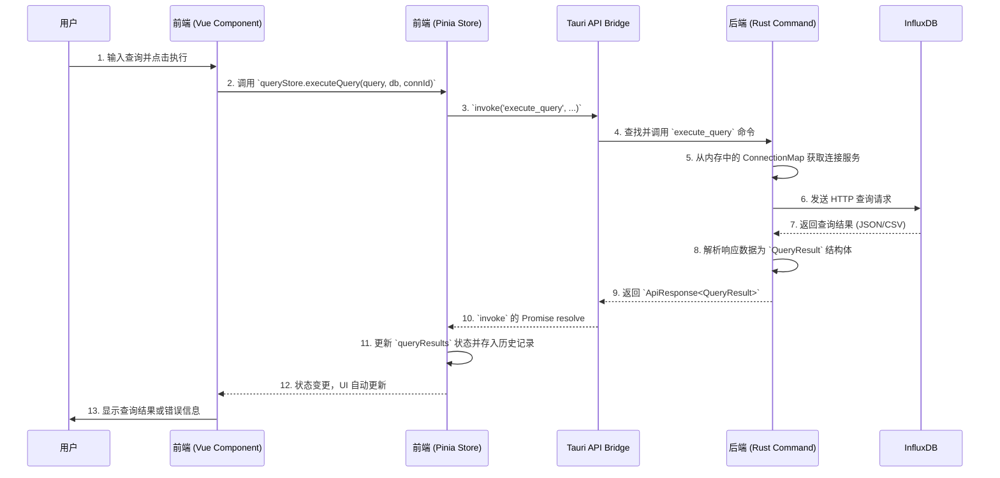

# InfluxDB Studio 技术架构文档

本文档旨在深入分析 InfluxDB Studio 的技术架构、代码结构和核心逻辑，为后续的开发和维护提供清晰的指引。

## 1. 项目整体架构概览

InfluxDB Studio 是一个基于 [Tauri](https://tauri.app/) 框架构建的跨平台桌面应用程序。它采用现代 Web 技术栈作为前端界面，并利用 Rust 提供强大的后端能力，从而实现高性能、安全且轻量级的用户体验。

其核心架构可以分为三个主要部分：

1.  **前端 (Frontend)**：使用 **Vue 3** (Composition API) 和 **TypeScript** 构建，负责所有用户界面的渲染和交互。
2.  **后端 (Backend)**：使用 **Rust** 编写，负责处理业务逻辑、与数据库进行通信以及执行系统级操作。
3.  **Tauri Bridge**: 作为前端和后端之间的桥梁，允许 JavaScript 安全地调用 Rust 函数 (称为 **Commands**)，并处理它们之间的事件和消息传递。

这种混合架构充分利用了 Web 技术的开发效率和生态系统，同��借助 Rust 实现了接近本机的性能和内存安全。

### 1.1. 整体架构图

```mermaid
graph TD
    subgraph 用户界面 (Desktop Window)
        A[前端: Vue.js + TypeScript]
    end

    subgraph 后端 (Rust Core)
        C[Rust 业务逻辑]
        D[InfluxDB 客户端]
    end

    A -- Tauri API (invoke, event) --> B[Tauri Bridge]
    B -- Command Handler --> C
    C -- 调用 --> D
    D -- HTTP/S --> E[InfluxDB 实例]

    style A fill:#42b883,stroke:#333,stroke-width:2px
    style C fill:#f74c00,stroke:#333,stroke-width:2px
    style E fill:#22ADF6,stroke:#333,stroke-width:2px
```

## 2. 技术栈详情

-   **核心框架**: [Tauri](https://tauri.app/)
-   **前端**:
    -   UI 框架: [Vue 3](https://vuejs.org/) (Composition API)
    -   语言: [TypeScript](https://www.typescriptlang.org/)
    -   构建工具: [Vite](https://vitejs.dev/)
    -   UI 组件库: [Element Plus](https://element-plus.org/)
    -   状态管理: [Pinia](https://pinia.vuejs.org/)
    -   路由: [Vue Router](https://router.vuejs.org/)
    -   代码编辑器: [Monaco Editor](https://microsoft.github.io/monaco-editor/)
-   **后端**:
    -   语言: [Rust](https://www.rust-lang.org/)
    -   异步运行时: [Tokio](https://tokio.rs/)
    -   HTTP 客户端: [Reqwest](https://github.com/seanmonstar/reqwest)
    -   序列化/反序列化: [Serde](https://serde.rs/)
    -   InfluxDB 交互: `influxdb` (v1) 和 `influxdb2` (v2/v3) crates

## 3. 数据流架构

本节以最核心的 **"执行查询"** 功能为例，阐述应用的内部数据流和组件交互。

### 3.1. 数据流架构图



### 3.2. 流程详解

1.  **用户交互**: 用户在 `QueryEditor.vue` 等组件中输入查询语句，选择目标数据库，然后点击执行按钮。
2.  **Store Action**: UI 组件触发 `queryStore` (位于 `src/stores/queryStore.ts`) 的 `executeQuery` action。此 action 从 `connectionStore` 获取当前激活的连接 ID (`connectionId`)。
3.  **Tauri 调用**: `queryStore` 使用 `@tauri-apps/api` 的 `invoke` 函数，异步调用在 Rust 后端注册的 `execute_query` 命令。
4.  **Rust 命令处理**: `src-tauri/src/main.rs` 中注册的 handler 将调用路由到 `src-tauri/src/commands.rs` 中的 `execute_query` 函数。
5.  **服务定位**: 该函数通过 `connectionId` 从 `ConnectionMap` (一个全局共享的 `Mutex<HashMap<...>>`) 中获取对应的 `InfluxDBService` 实例。这个 Map 在用户连接数据库时被填充。
6.  **数据库通信**: `src-tauri/src/influxdb.rs` 中的服务实例根据连接版本（v1/v2）构建并发送一个 HTTP 请求到目标 InfluxDB 服务器。
7.  **响应解析**: Rust 后端接收到 InfluxDB 的响应，并将其解析成统一的 `QueryResult` Rust 结构体。
8.  **返回前端**: `QueryResult` 被包装后通过 Tauri Bridge 返回给前端的 JavaScript 调用。
9.  **状态更新**: `queryStore` 接收到数据，更新内部的 `queryResults` 状态，并将此次查询存入 `queryHistory`。
10. **UI 渲染**: 任何依赖 `queryResults` 状态的 Vue 组件都会自动重新渲染，从而在界面上展示数据表格或错误信息。

## 4. 代码文件依赖与模块调用逻辑

### 4.1. 前端 (`src/`)

-   **`main.ts`**: 应用入口。初始化 Vue、Pinia、Vue Router 和 Element Plus。
-   **`router/index.ts`**: 定义应用的所有视图路由。采用 Hash 模式以兼容 Tauri。
-   **`stores/`**: Pinia 状态管理中心。
    -   `connectionStore.ts`: **核心状态**。管理所有数据库连接的配置（增删改查），并将其持久化到 `localStorage`。它负责调用 Rust 的 `connect_to_database` 和 `test_connection` 命令，并维护每个连接的实时状态（如 `connected`, `disconnected`, `error`）。
    -   `queryStore.ts`: 负责处理查询逻辑，包括执行查询、管理查询历史（持久化到 `localStorage`）和存储查询结果。
-   **`views/`**: 应用的主要页面级组件。
    -   `DatabaseExplorer.vue`: 数据库浏览器，用于展示数据库、测量等信息。
    -   `QueryEditor.vue`: 查询编辑器，内嵌 Monaco Editor，是用户执行查询的主要界面。
-   **`utils/`**: 通用工具函数。
-   **`types/influxdb.ts`**: 定义了与 Rust 后端共享数据结构（如 `ConnectionProfile`）的 TypeScript 类型。

### 4.2. 后端 (`src-tauri/`)

-   **`src/main.rs`**: Rust 应用入口。
    -   使用 `tauri::Builder` 构建应用。
    -   使用 `.manage()` 将 `ConnectionMap` 注册为 Tauri 的 **托管状态(Managed State)**，使其可以在所有 command 中被安全地共享访问。
    -   使用 `.invoke_handler()` 和 `generate_handler![]` 宏注册所有暴露给前端的 Rust 函数。
-   **`src/commands.rs`**: **前后端接口定义**。
    -   定义了所有 `#[tauri::command]` 函数，如 `connect_to_database`, `execute_query`, `get_databases` 等。
    -   定义了 `ConnectionMap` 类型别名，用于存储活跃的数据库连接服务实例。
    -   函数通过 `State<'_, ConnectionMap>` 参数访问托管状态。
-   **`src/influxdb.rs`**: **核心业务逻辑**。
    -   定义了 `InfluxDBService` 枚举，用于处理不同 InfluxDB 版本（v1/v2/v3）的逻辑分发。
    -   `InfluxDBV1Service` 和 `InfluxDBV2Service` 结构体分别实现了针对不同版本 InfluxDB 的 `ping`, `query`, `get_databases` 等方法。
    -   `create_influxdb_service` 工厂函数根据连接配置创建对应的服务实例。
-   **`src/models.rs`**: 定义了 Rust 的数据结构，如 `ConnectionProfile`, `QueryResult`, `DatabaseInfo` 等。这些结构体使用 `serde::{Serialize, Deserialize}` 进行序列化，以便在前后端之间传递。
-   **`tauri.conf.json`**: Tauri 配置文件。定义了应用标识、窗口属性、构建命令以及 **`allowlist`**（用于控制前端可访问的系统 API 权限）。

## 5. 关键代码文件定位索引

-   **Tauri 命令定义 (Rust)**: `src-tauri/src/commands.rs`
-   **InfluxDB 核心交互逻辑 (Rust)**: `src-tauri/src/influxdb.rs`
-   **Rust 数据模型 (与 TS 对应)**: `src-tauri/src/models.rs`
-   **Tauri 应用启动与配置 (Rust)**: `src-tauri/src/main.rs`
-   **前端状态管理 (连接)**: `src/stores/connectionStore.ts`
-   **前端状态管理 (查询)**: `src/stores/queryStore.ts`
-   **前端路由**: `src/router/index.ts`
-   **前后端交互的数据类型 (TS)**: `src/types/influxdb.ts`
-   **应用主配置文件 (Tauri)**: `src-tauri/tauri.conf.json`
-   **前端依赖**: `package.json`
-   **后端依赖**: `src-tauri/Cargo.toml`