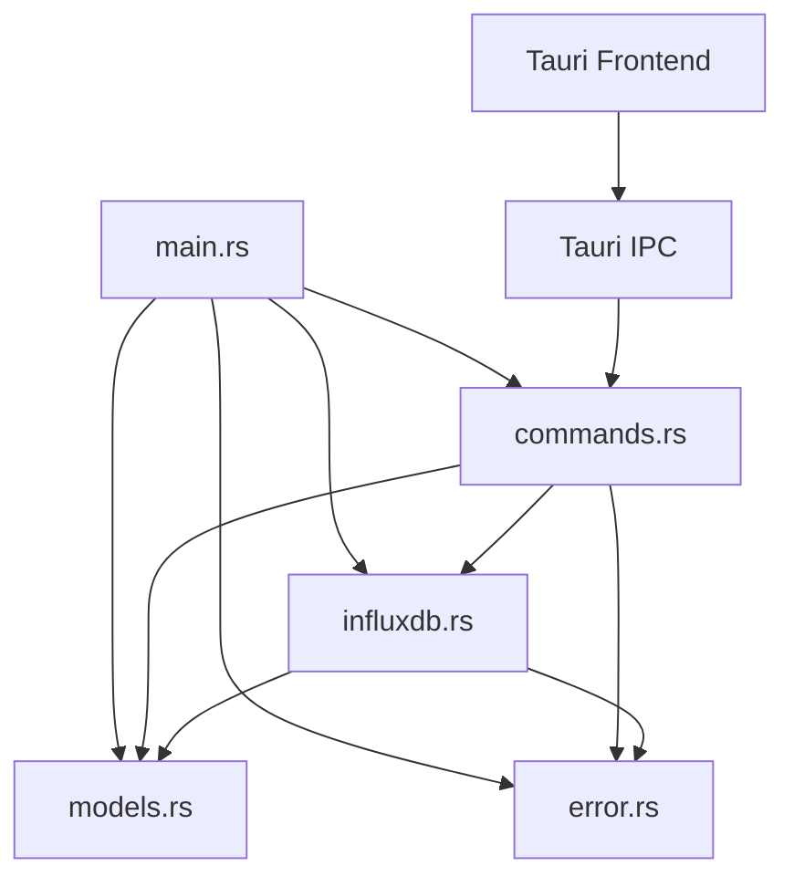
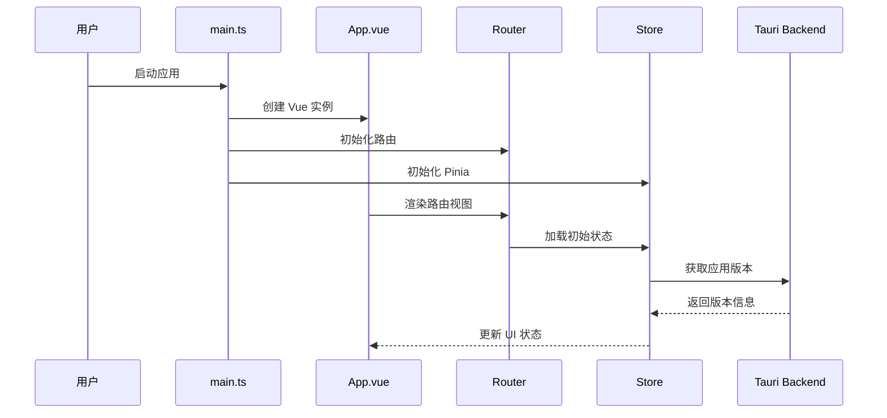
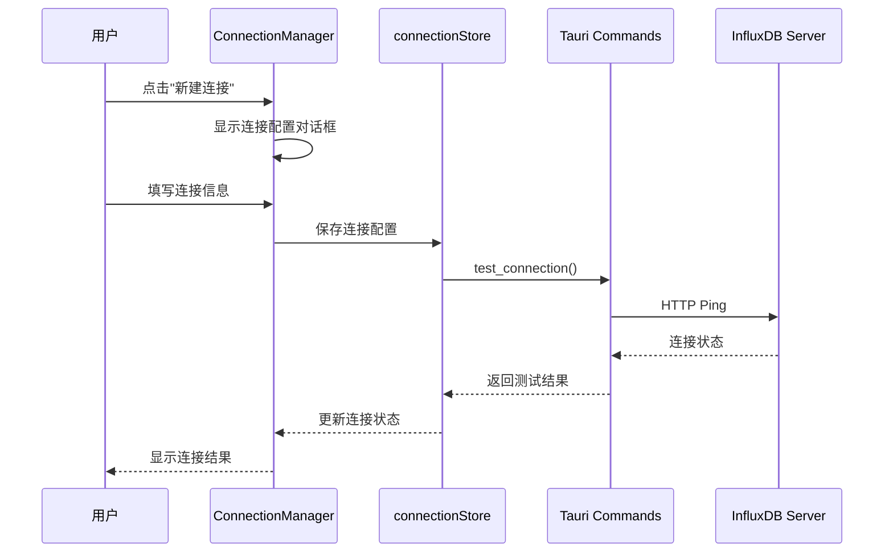
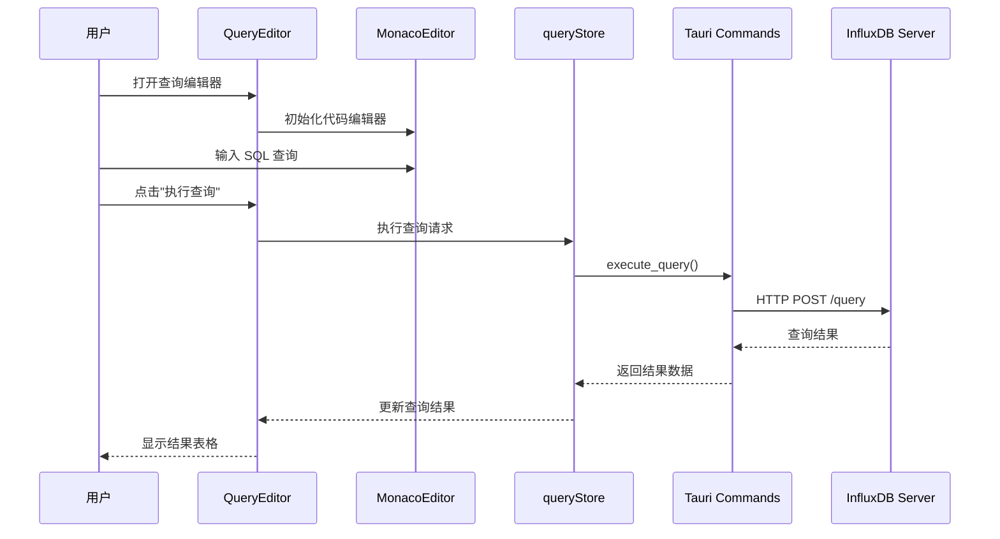
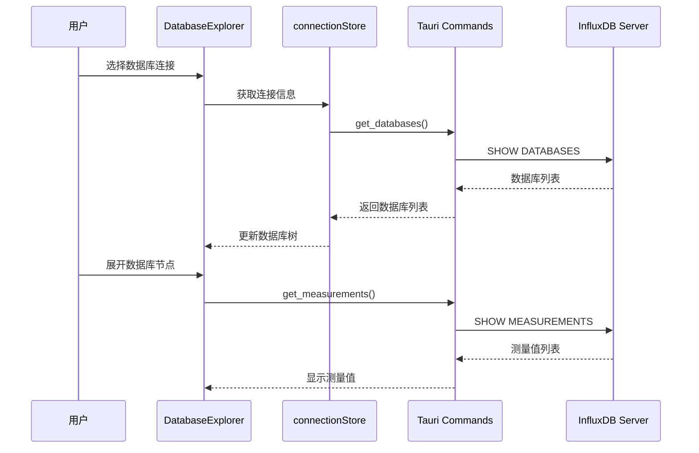
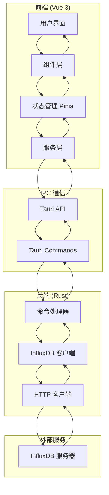

# InfluxDB Studio 项目技术文档

## 📋 项目概览

**项目名称**: InfluxDB Studio  
**项目描述**: 基于 Tauri 2.0 + Vue 3 + TypeScript 的现代化 InfluxDB 数据库管理工具  
**技术架构**: 跨平台桌面应用程序  
**开发状态**: 开发中 (v0.1.0)  
**最后更新**: 2025年1月

## 🏗️ 项目整体架构概览

### 技术栈

#### 前端技术栈
使用pnpm替代npm
```json
{
  "框架": "Vue 3.4.0 + TypeScript 5.2.2",
  "构建工具": "Vite 5.2.0",
  "UI组件库": "Element Plus 2.6.0",
  "状态管理": "Pinia 2.1.0",
  "路由管理": "Vue Router 4.3.0",
  "数据获取": "@tanstack/vue-query 5.40.0",
  "代码编辑器": "Monaco Editor 0.47.0",
  "图标库": "@element-plus/icons-vue 2.3.1"
}
```

#### 后端技术栈
```toml
[dependencies]
tauri = "2.0"                    # 跨平台应用框架
tauri-plugin-shell = "2.0"      # Shell 插件
serde = "1.0"                    # 序列化/反序列化
serde_json = "1.0"               # JSON 处理
tokio = "1.0"                    # 异步运行时
reqwest = "0.11"                 # HTTP 客户端
anyhow = "1.0"                   # 错误处理
tracing = "0.1"                  # 日志追踪
tracing-subscriber = "0.3"       # 日志订阅器
chrono = "0.4"                   # 时间处理
uuid = "1.0"                     # UUID 生成
```

### 架构模式

**整体架构**: 客户端-服务器架构 (C/S)
- **前端**: Vue 3 单页应用 (SPA)
- **后端**: Tauri Rust 核心 + InfluxDB HTTP API
- **通信**: Tauri IPC (Inter-Process Communication)

**设计模式**:
- **前端**: MVVM (Model-View-ViewModel) 
- **后端**: 命令模式 (Command Pattern)
- **状态管理**: Flux 架构 (基于 Pinia)

## 📁 项目目录结构

```
influxdb-studio/
├── src/                          # 前端源码
│   ├── main.ts                   # 应用入口点
│   ├── App.vue                   # 根组件
│   ├── components/               # 组件库
│   │   ├── Layout/              # 布局组件
│   │   │   ├── MainLayout.vue   # 主布局容器
│   │   │   └── Sidebar.vue      # 侧边栏导航
│   │   ├── Common/              # 通用组件
│   │   │   └── MonacoEditor.vue # 代码编辑器
│   │   └── Connection/          # 连接管理组件
│   │       └── ConnectionDialog.vue # 连接配置对话框
│   ├── views/                   # 页面视图
│   │   ├── Home.vue             # 首页
│   │   ├── ConnectionManager.vue # 连接管理页面
│   │   ├── DatabaseExplorer.vue # 数据库浏览器
│   │   ├── QueryEditor.vue      # 查询编辑器
│   │   └── Settings.vue         # 设置页面
│   ├── stores/                  # 状态管理
│   │   ├── connectionStore.ts   # 连接状态管理
│   │   └── queryStore.ts        # 查询状态管理
│   └── router/                  # 路由配置
│       └── index.ts             # 路由定义
├── src-tauri/                   # Tauri 后端
│   ├── src/
│   │   ├── main.rs              # Rust 主程序
│   │   ├── commands.rs          # Tauri 命令处理
│   │   ├── influxdb.rs          # InfluxDB 客户端
│   │   ├── models.rs            # 数据模型定义
│   │   └── error.rs             # 错误处理
│   ├── Cargo.toml               # Rust 依赖配置
│   └── tauri.conf.json          # Tauri 配置文件
├── .github/                     # GitHub Actions
│   └── workflows/
│       └── build.yml            # 构建和发布流程
├── .dev/                        # 开发文档
├── dist/                        # 构建产物
├── package.json                 # 前端依赖配置
├── vite.config.ts               # Vite 构建配置
└── tsconfig.json                # TypeScript 配置
```

## 🔗 代码文件依赖关系

### 前端依赖关系图

```mermaid
graph TD
    A[main.ts] --> B[App.vue]
    A --> C[router/index.ts]
    A --> D[stores/]
    
    B --> E[components/Layout/MainLayout.vue]
    E --> F[components/Layout/Sidebar.vue]
    E --> G[router-view]
    
    C --> H[views/Home.vue]
    C --> I[views/ConnectionManager.vue]
    C --> J[views/DatabaseExplorer.vue]
    C --> K[views/QueryEditor.vue]
    C --> L[views/Settings.vue]
    
    I --> M[components/Connection/ConnectionDialog.vue]
    K --> N[components/Common/MonacoEditor.vue]
    
    D --> O[stores/connectionStore.ts]
    D --> P[stores/queryStore.ts]
    
    O --> Q[@tauri-apps/api]
    P --> Q
```

### 后端依赖关系图



### 关键依赖说明

| 依赖类型 | 说明 | 文件路径 |
|---------|------|----------|
| **应用入口** | Vue 应用初始化 | `src/main.ts` |
| **路由管理** | 页面路由配置 | `src/router/index.ts` |
| **状态管理** | 全局状态存储 | `src/stores/*.ts` |
| **组件库** | UI 组件复用 | `src/components/**/*.vue` |
| **页面视图** | 应用页面组件 | `src/views/*.vue` |
| **Tauri 核心** | 后端主程序 | `src-tauri/src/main.rs` |
| **API 命令** | 前后端通信接口 | `src-tauri/src/commands.rs` |
| **数据库客户端** | InfluxDB 操作 | `src-tauri/src/influxdb.rs` |

## ⚙️ 功能模块调用逻辑

### 1. 应用启动流程



### 2. 连接管理流程



### 3. 查询执行流程



### 4. 数据库浏览流程



## 🔧 关键代码文件定位索引

### 前端关键文件

| 文件路径 | 行数 | 职责描述 | 重要性 | 关键功能 |
|---------|------|----------|--------|----------|
| `src/main.ts` | 26 | 应用入口点和初始化 | ⭐⭐⭐⭐⭐ | Vue 应用创建、插件注册、路由挂载 |
| `src/App.vue` | 31 | 根组件和全局布局 | ⭐⭐⭐⭐ | 全局样式、路由出口、主题配置 |
| `src/router/index.ts` | 51 | 路由配置和导航 | ⭐⭐⭐⭐ | 页面路由、路由守卫、页面标题 |
| `src/stores/connectionStore.ts` | 194 | 连接状态管理 | ⭐⭐⭐⭐⭐ | 连接配置、状态管理、Tauri 通信 |
| `src/stores/queryStore.ts` | 198 | 查询状态管理 | ⭐⭐⭐⭐⭐ | 查询执行、结果处理、历史记录 |
| `src/views/Home.vue` | 199 | 首页和功能导航 | ⭐⭐⭐ | 功能入口、应用介绍、快捷操作 |
| `src/views/ConnectionManager.vue` | 376 | 连接管理界面 | ⭐⭐⭐⭐⭐ | 连接列表、连接测试、连接配置 |
| `src/views/DatabaseExplorer.vue` | 436 | 数据库浏览器 | ⭐⭐⭐⭐⭐ | 数据库树、测量值浏览、数据预览 |
| `src/views/QueryEditor.vue` | 451 | 查询编辑器 | ⭐⭐⭐⭐⭐ | SQL 编辑、查询执行、结果展示 |
| `src/views/Settings.vue` | 453 | 应用设置 | ⭐⭐⭐ | 配置管理、主题设置、导入导出 |
| `src/components/Layout/MainLayout.vue` | 21 | 主布局容器 | ⭐⭐⭐⭐ | 布局结构、侧边栏集成、内容区域 |
| `src/components/Layout/Sidebar.vue` | 59 | 侧边栏导航 | ⭐⭐⭐⭐ | 导航菜单、路由跳转、菜单状态 |
| `src/components/Common/MonacoEditor.vue` | 117 | 代码编辑器组件 | ⭐⭐⭐⭐ | 代码编辑、语法高亮、编辑器配置 |
| `src/components/Connection/ConnectionDialog.vue` | 257 | 连接配置对话框 | ⭐⭐⭐⭐ | 连接表单、数据验证、配置保存 |

### 后端关键文件

| 文件路径 | 行数 | 职责描述 | 重要性 | 关键功能 |
|---------|------|----------|--------|----------|
| `src-tauri/src/main.rs` | 52 | Tauri 应用入口 | ⭐⭐⭐⭐⭐ | 应用初始化、命令注册、连接管理 |
| `src-tauri/src/commands.rs` | 312 | Tauri 命令处理 | ⭐⭐⭐⭐⭐ | API 命令、参数处理、响应封装 |
| `src-tauri/src/influxdb.rs` | 251 | InfluxDB 客户端 | ⭐⭐⭐⭐⭐ | HTTP 通信、查询执行、数据解析 |
| `src-tauri/src/models.rs` | 74 | 数据模型定义 | ⭐⭐⭐⭐ | 数据结构、序列化、类型定义 |
| `src-tauri/src/error.rs` | 70 | 错误处理机制 | ⭐⭐⭐ | 错误类型、错误转换、错误格式化 |

### 配置文件

| 文件路径 | 行数 | 职责描述 | 重要性 | 关键配置 |
|---------|------|----------|--------|----------|
| `package.json` | 36 | 前端依赖配置 | ⭐⭐⭐⭐ | 依赖管理、构建脚本、项目信息 |
| `src-tauri/Cargo.toml` | 32 | Rust 依赖配置 | ⭐⭐⭐⭐ | Rust 依赖、构建配置、项目元信息 |
| `src-tauri/tauri.conf.json` | 61 | Tauri 应用配置 | ⭐⭐⭐⭐⭐ | 应用配置、窗口设置、构建选项 |
| `vite.config.ts` | 21 | Vite 构建配置 | ⭐⭐⭐ | 构建优化、插件配置、开发服务器 |
| `tsconfig.json` | 25 | TypeScript 配置 | ⭐⭐⭐ | 编译选项、类型检查、路径映射 |

## 🎯 核心功能模块

### 1. 连接管理模块

**核心文件**:
- `src/stores/connectionStore.ts` - 连接状态管理
- `src/views/ConnectionManager.vue` - 连接管理界面
- `src/components/Connection/ConnectionDialog.vue` - 连接配置对话框
- `src-tauri/src/commands.rs` - 连接相关命令

**主要功能**:
- 连接配置管理 (增删改查)
- 连接测试和验证
- 多连接并发支持
- 连接状态监控
- SSL/TLS 安全连接

**关键 API**:
```rust
// Tauri 命令
test_connection(config: ConnectionConfig) -> ApiResponse<bool>
connect_to_database(config: ConnectionConfig) -> ApiResponse<String>
disconnect_from_database(connection_id: String) -> ApiResponse<bool>
```

### 2. 数据库操作模块

**核心文件**:
- `src/views/DatabaseExplorer.vue` - 数据库浏览器
- `src-tauri/src/influxdb.rs` - InfluxDB 客户端
- `src-tauri/src/commands.rs` - 数据库操作命令

**主要功能**:
- 数据库列表展示
- 测量值 (Measurements) 浏览
- 数据库信息查询
- 数据库创建和删除
- 保留策略管理

**关键 API**:
```rust
// Tauri 命令
get_databases(connection_id: String) -> ApiResponse<Vec<String>>
get_database_info(connection_id: String, database: String) -> ApiResponse<DatabaseInfo>
create_database(connection_id: String, database: String) -> ApiResponse<bool>
drop_database(connection_id: String, database: String) -> ApiResponse<bool>
get_measurements(connection_id: String, database: String) -> ApiResponse<Vec<String>>
```

### 3. 查询执行模块

**核心文件**:
- `src/views/QueryEditor.vue` - 查询编辑器界面
- `src/stores/queryStore.ts` - 查询状态管理
- `src/components/Common/MonacoEditor.vue` - 代码编辑器
- `src-tauri/src/commands.rs` - 查询执行命令

**主要功能**:
- SQL 查询编辑 (语法高亮)
- 查询执行和结果展示
- 查询历史记录
- 结果数据导出
- 查询性能监控

**关键 API**:
```rust
// Tauri 命令
execute_query(connection_id: String, database: String, query: String) -> ApiResponse<QueryResult>
```

### 4. 用户界面模块

**核心文件**:
- `src/components/Layout/MainLayout.vue` - 主布局
- `src/components/Layout/Sidebar.vue` - 侧边栏导航
- `src/views/Home.vue` - 首页
- `src/views/Settings.vue` - 设置页面

**主要功能**:
- 响应式布局设计
- 导航菜单管理
- 主题切换支持
- 快捷键操作
- 多语言支持 (规划中)

## 🔄 数据流向图



## 🚀 构建和部署

### 开发环境

**前端开发**:
```bash
# 安装依赖
pnpm install

# 启动开发服务器
pnpm run dev

# 构建生产版本
pnpm run build
```

**后端开发**:
```bash
# 启动 Tauri 开发模式
pnpm run tauri dev

# 构建 Tauri 应用
pnpm run tauri build
```

### 构建产物

| 平台 | 产物类型 | 文件大小 | 安装包格式 |
|------|----------|----------|------------|
| **Windows** | 可执行文件 | ~15MB | MSI, EXE |
| **macOS** | 应用包 | ~12MB | DMG, APP |
| **Linux** | 二进制文件 | ~17MB | DEB, RPM, AppImage |

### CI/CD 流程

**GitHub Actions** (`.github/workflows/build.yml`):
1. 多平台并行构建 (Windows, macOS, Linux)
2. 自动化测试和质量检查
3. 构建产物上传和发布
4. 版本标签管理

## 📊 性能指标

### 应用性能

| 指标 | 目标值 | 当前值 | 备注 |
|------|--------|--------|------|
| **启动时间** | < 3秒 | ~2秒 | 冷启动时间 |
| **内存使用** | < 200MB | ~150MB | 运行时内存 |
| **安装包大小** | < 20MB | ~15MB | 压缩后大小 |
| **查询响应时间** | < 2秒 | ~1秒 | 简单查询 |

### 代码质量

| 指标 | 目标值 | 当前值 | 备注 |
|------|--------|--------|------|
| **TypeScript 覆盖率** | > 90% | ~85% | 类型安全 |
| **组件复用率** | > 80% | ~75% | 组件化程度 |
| **代码行数** | - | ~3000 | 前端+后端 |
| **依赖数量** | < 50 | 42 | 直接依赖 |

## 🛡️ 安全考虑

### 数据安全
- **连接加密**: 支持 SSL/TLS 连接
- **凭据存储**: 本地加密存储敏感信息
- **权限控制**: 基于 InfluxDB 用户权限
- **输入验证**: 严格的参数验证和 SQL 注入防护

### 应用安全
- **代码签名**: 构建产物数字签名
- **沙箱机制**: Tauri 安全沙箱
- **权限最小化**: 最小权限原则
- **更新机制**: 安全的自动更新

## 🔮 未来规划

### 短期计划 (v0.2.0)
- [ ] 数据可视化图表
- [ ] 查询结果导出 (CSV, JSON)
- [ ] 查询性能分析
- [ ] 连接池管理优化

### 中期计划 (v0.3.0)
- [ ] 多语言支持 (i18n)
- [ ] 主题自定义
- [ ] 插件系统
- [ ] 数据备份和恢复

### 长期计划 (v1.0.0)
- [ ] 集群管理支持
- [ ] 实时监控面板
- [ ] 用户权限管理
- [ ] 企业级功能

## 📚 开发指南

### 添加新功能
1. **前端**: 在 `src/views/` 添加新页面
2. **路由**: 在 `src/router/index.ts` 添加路由
3. **状态**: 在 `src/stores/` 添加状态管理
4. **后端**: 在 `src-tauri/src/commands.rs` 添加命令
5. **类型**: 在 `src-tauri/src/models.rs` 添加数据模型

### 调试技巧
- **前端调试**: 使用 Vue DevTools
- **后端调试**: 使用 `tracing` 日志
- **IPC 调试**: 查看 Tauri 命令日志
- **网络调试**: 监控 HTTP 请求

### 测试策略
- **单元测试**: 核心逻辑函数测试
- **集成测试**: 组件交互测试
- **端到端测试**: 完整流程测试
- **性能测试**: 大数据量查询测试

---

**文档版本**: 1.0  
**创建时间**: 2025年1月11日  
**维护者**: 开发团队  
**联系方式**: 项目 GitHub Issues 