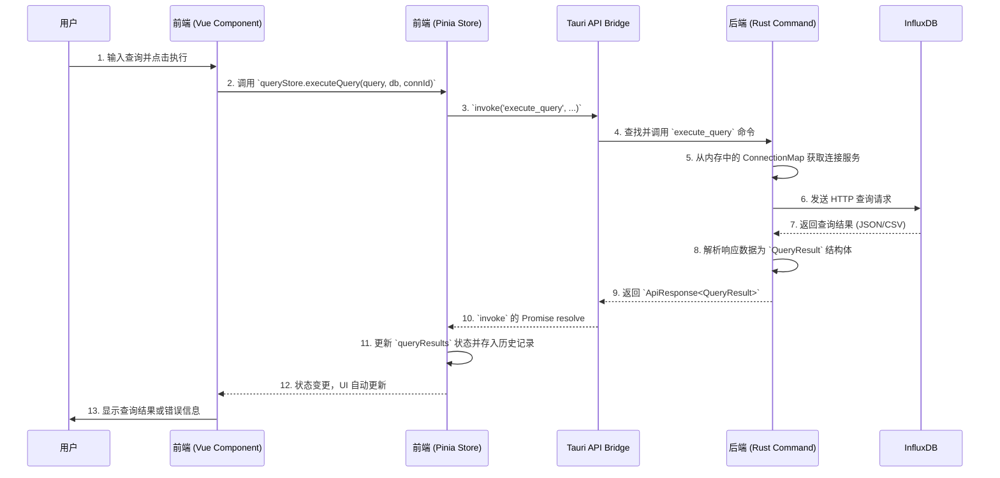

# 技术架构文档

## 项目概览

InfluxDB Studio 是一个基于 [Tauri](https://tauri.app/) 框架构建的跨平台桌面应用程序，采用现代 Web 技术栈作为前端界面，并利用 Rust 提供强大的后端能力。

### 核心架构

```mermaid
graph TD
    subgraph 用户界面 (Desktop Window)
        A[前端: Vue.js + TypeScript]
    end

    subgraph 后端 (Rust Core)
        C[Rust 业务逻辑]
        D[InfluxDB 客户端]
    end

    A -- Tauri API (invoke, event) --> B[Tauri Bridge]
    B -- Command Handler --> C
    C -- 调用 --> D
    D -- HTTP/S --> E[InfluxDB 实例]

    style A fill:#42b883,stroke:#333,stroke-width:2px
    style C fill:#f74c00,stroke:#333,stroke-width:2px
    style E fill:#22ADF6,stroke:#333,stroke-width:2px
```

## 技术栈

### 前端技术栈
- **核心框架**: Vue 3 (Composition API)
- **语言**: TypeScript
- **构建工具**: Vite
- **UI 组件库**: Element Plus
- **状态管理**: Pinia
- **路由**: Vue Router
- **代码编辑器**: Monaco Editor

### 后端技术栈
- **语言**: Rust
- **异步运行时**: Tokio
- **HTTP 客户端**: Reqwest
- **序列化/反序列化**: Serde
- **InfluxDB 交互**: `influxdb` (v1) 和 `influxdb2` (v2/v3) crates

## 数据流架构

### 查询执行流程



## 项目结构

### 前端结构 (`src/`)

```
src/
├── main.ts                   # 应用入口
├── App.vue                   # 根组件
├── components/               # 组件库
│   ├── Layout/              # 布局组件
│   ├── Common/              # 通用组件
│   └── Connection/          # 连接管理组件
├── views/                   # 页面视图
│   ├── Home.vue             # 首页
│   ├── ConnectionManager.vue # 连接管理
│   ├── DatabaseExplorer.vue # 数据库浏览器
│   ├── QueryEditor.vue      # 查询编辑器
│   └── Settings.vue         # 设置页面
├── stores/                  # 状态管理 (Pinia)
│   ├── connectionStore.ts   # 连接状态管理
│   └── queryStore.ts        # 查询状态管理
├── router/                  # 路由配置
│   └── index.ts             # 路由定义
├── utils/                   # 通用工具函数
└── types/                   # TypeScript 类型定义
    └── influxdb.ts          # 与后端共享的数据类型
```

### 后端结构 (`src-tauri/`)

```
src-tauri/
├── src/
│   ├── main.rs              # Rust 应用入口
│   ├── commands.rs          # Tauri 命令处理
│   ├── influxdb.rs          # InfluxDB 客户端
│   ├── models.rs            # 数据模型定义
│   └── error.rs             # 错误处理
├── Cargo.toml               # Rust 依赖配置
└── tauri.conf.json          # Tauri 配置文件
```

## 核心模块说明

### 前端核心模块

#### 状态管理 (Pinia Stores)

**connectionStore.ts**
- 管理所有数据库连接的配置
- 持久化到 `localStorage`
- 调用 Rust 的 `connect_to_database` 和 `test_connection` 命令
- 维护连接状态（connected, disconnected, error）

**queryStore.ts**
- 处理查询逻辑
- 管理查询历史和结果
- 持久化查询历史到 `localStorage`

#### 主要组件

**QueryEditor.vue**
- 查询编辑器，内嵌 Monaco Editor
- 用户执行查询的主要界面
- 支持语法高亮和自动补全

**DatabaseExplorer.vue**
- 数据库浏览器
- 展示数据库、测量等信息
- 支持树形结构导航

### 后端核心模块

#### 命令处理 (commands.rs)
- 定义所有 `#[tauri::command]` 函数
- 处理前后端通信
- 管理 `ConnectionMap` 类型别名

#### InfluxDB 客户端 (influxdb.rs)
- 定义 `InfluxDBService` 枚举
- 处理不同 InfluxDB 版本（v1/v2/v3）的逻辑分发
- 实现针对不同版本的客户端服务

#### 数据模型 (models.rs)
- 定义 Rust 数据结构
- 使用 `serde` 进行序列化
- 与前端 TypeScript 类型对应

## 多版本支持架构

### 版本兼容性设计

项目采用模块化设计支持 InfluxDB 的多个版本：

```rust
pub enum InfluxDBService {
    V1(InfluxDBV1Service),
    V2(InfluxDBV2Service),
    V3(InfluxDBV3Service),
}
```

### 连接配置结构

```typescript
interface ConnectionProfile {
  id: string;
  name: string;
  version: 'v1' | 'v2' | 'v3';
  config: InfluxDBV1Config | InfluxDBV2Config | InfluxDBV3Config;
}
```

## 性能优化

### 前端优化
- Vue 3 的 Composition API 提供更好的性能
- Pinia 状态管理减少不必要的重渲染
- Monaco Editor 的懒加载和虚拟化

### 后端优化
- Rust 的零成本抽象
- Tokio 异步运行时
- 连接池和缓存机制

## 安全考虑

### 数据安全
- 连接凭据本地加密存储
- HTTPS 通信加密
- 输入验证和 SQL 注入防护

### 应用安全
- Tauri 的安全沙盒
- 最小权限原则
- 代码签名和完整性验证

## 扩展性设计

### 插件系统
- 支持自定义查询模板
- 可扩展的数据可视化组件
- 第三方集成接口

### 配置管理
- 用户偏好设置
- 主题和界面定制
- 快捷键配置 